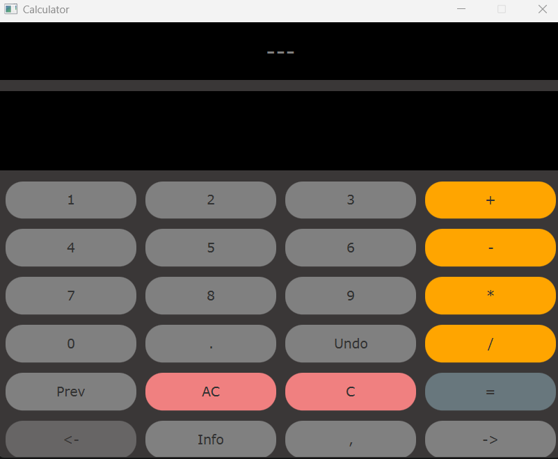
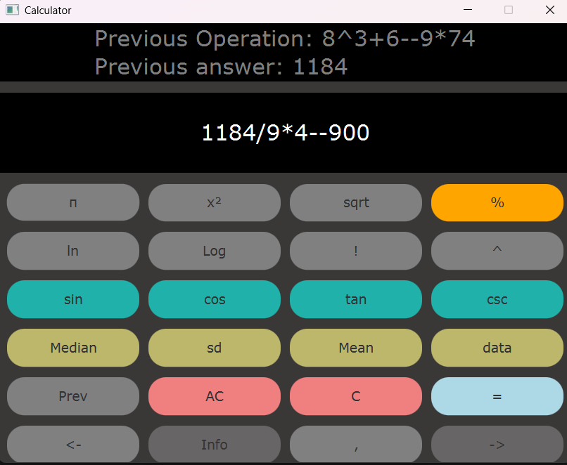
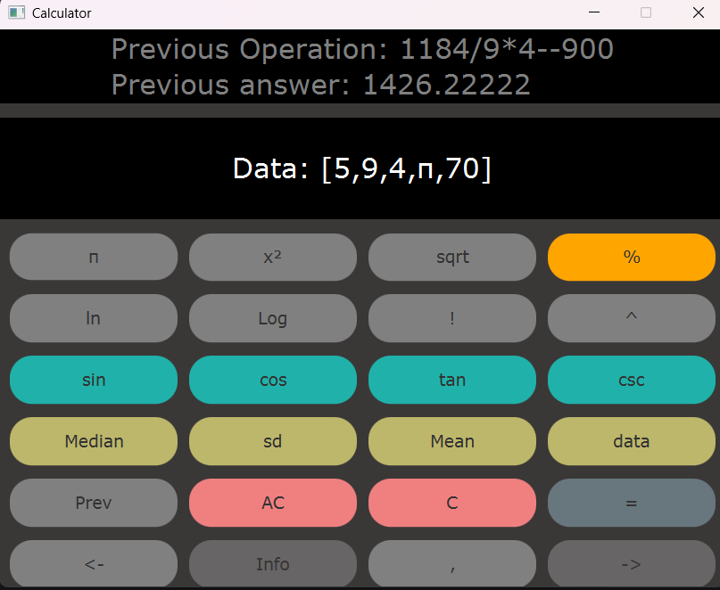

## Purpose
This is my first ever project with a GUI. 
This project is a scientific calculator that can compute basic mathmatical, trigonometric, logarthmic, and statistical expressions.

## Installation
To run this project, it requires that you have java 11 or higher and javafx 17 or higher installed onto your system.

## Usage
To run this project, include the bin and lib folders from your javafx folder in the directory this program is in.  
Configure your launch.json file to include the configuration:    "vm-Args": "--module-path ./lib --add-modules=javafx.controls".   
If you have the java extension pack, you can simply click the "run" button on top of the main method in vscode.

## Images
### Starting Screen:

 
### Calculations:

 
### Making a Data set:

